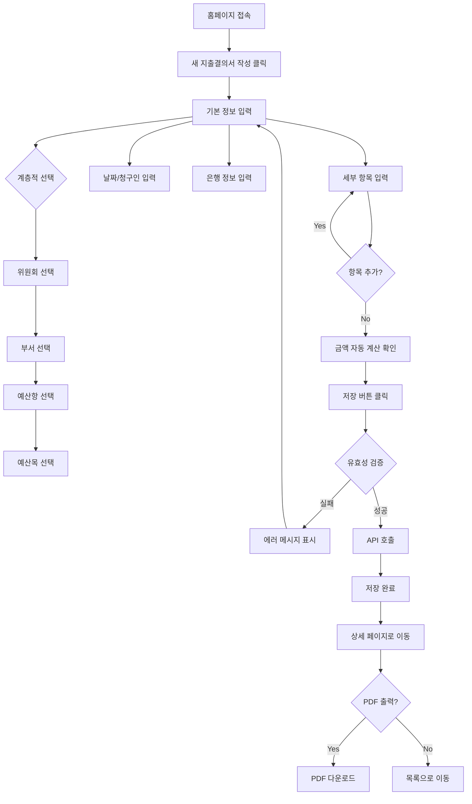
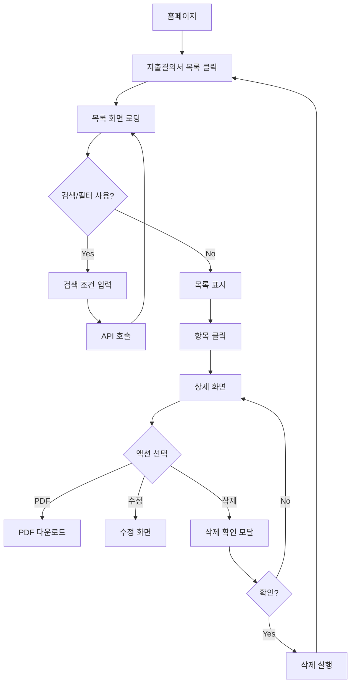

# 지출결의서 관리 시스템 MVP - Product Requirements Document (PRD)

**프로젝트명:** 교회 지출결의서 관리 시스템  
**버전:** 1.0.0 (MVP)  
**작성일:** 2024-12-01
**최종 수정:** 2026-03-29
**개발 환경:** Claude Code  
**대상 사용자:** 교회 재정팀 및 각 부서 담당자 (~100명)  
**배포 환경:** Render + Neon

---

## 📋 목차

1. [프로젝트 개요](#1-프로젝트-개요)
2. [비즈니스 목표](#2-비즈니스-목표)
3. [사용자 페르소나](#3-사용자-페르소나)
4. [핵심 기능 요구사항](#4-핵심-기능-요구사항)
5. [기술 스택](#5-기술-스택)
6. [데이터 구조](#6-데이터-구조)
7. [사용자 플로우](#7-사용자-플로우)
8. [UI/UX 요구사항](#8-uiux-요구사항)
9. [개발 우선순위](#9-개발-우선순위)
10. [비기능 요구사항](#10-비기능-요구사항)
11. [제약사항 및 가정](#11-제약사항-및-가정)
12. [성공 지표](#12-성공-지표)
13. [향후 확장 계획](#13-향후-확장-계획)

---

## 1. 프로젝트 개요

### 1.1 배경
- 현재 엑셀(Ver 4.1.3)로 지출결의서 작성 중
- 204개의 계층적 예산 항목 관리 필요
- 수기 작성 및 파일 관리의 비효율성
- 데이터 집계 및 검색의 어려움

### 1.2 목표
기존 엑셀 양식을 웹 애플리케이션으로 전환하여:
- 지출결의서 작성 효율성 향상
- 체계적인 데이터 관리
- 빠른 검색 및 조회
- PDF 출력으로 결재 프로세스 지원

### 1.3 범위 (MVP)
**포함:**
- 지출결의서 작성 (CRUD)
- 계층적 예산 선택 (위원회 → 부서 → 항 → 목 → 세목)
- 자동 금액 계산 (10원 단위 절사)
- PDF 출력
- 목록 조회 및 검색

**제외 (향후 Phase):**
- 사용자 인증/권한 관리
- 승인 워크플로우
- 예산 관리 및 집행 현황
- 이메일/알림 기능
- 모바일 앱

---

## 2. 비즈니스 목표

### 2.1 주요 목표
1. **효율성 향상**: 지출결의서 작성 시간 50% 단축
2. **데이터 정확성**: 자동 계산으로 오류 90% 감소
3. **접근성 개선**: 언제 어디서나 웹 브라우저로 접근
4. **검색 가능성**: 과거 지출 내역 즉시 검색

### 2.2 성공 기준
- 100명 동시 사용자 지원
- 페이지 로딩 시간 < 2초
- 사용자 만족도 > 80%
- 월 평균 작성 건수 > 50건

---

## 3. 사용자 페르소나

### 3.1 재정팀 담당자 (주 사용자)
```yaml
이름: 정혜중
역할: 재정팀
나이: 35세
기술 수준: 중급 (엑셀 능숙)

목표:
- 각 부서의 지출 신청 접수
- 지출결의서 검토 및 정리
- 회계 장부 정리를 위한 데이터 추출

Pain Points:
- 엑셀 파일 버전 관리 어려움
- 예산 항목 찾기 시간 소요
- 과거 내역 찾기 어려움
```

### 3.2 부서 담당자 (일반 사용자)
```yaml
이름: 김민광
역할: 찬양팀 리더
나이: 28세
기술 수준: 초급 (기본 웹 사용)

목표:
- 팀 활동 비용 지출 신청
- 간단하고 빠른 작성

Pain Points:
- 예산 항목 선택 복잡함
- 계산 실수 우려
- 양식 작성법 매번 확인
```

---

## 4. 핵심 기능 요구사항

### 4.1 지출결의서 작성 (Create)

#### 기본 정보 입력
```
필수 입력:
- 위원회 (드롭다운)
- 사역팀(부) (드롭다운, 위원회에 따라 필터링)
- 예산(항) (드롭다운, 부서에 따라 필터링)
- 예산(목) (드롭다운, 항에 따라 필터링)
- 청구일자 (날짜 선택)
- 청구인 (텍스트)
- 은행명 (텍스트)
- 계좌번호 (텍스트)
- 예금주 (텍스트, 기본값: 청구인)

선택 입력:
- 지출일자 (날짜 선택, 재정팀이 나중에 입력)
- 청구팀부 (텍스트)
```

#### 세부 항목 입력 (최대 10개)
```
각 항목당:
- 예산(세목) (드롭다운, 목에 따라 필터링)
- 적요 (텍스트, 필수)
- 단가 (숫자, 필수)
- 인원(수량) (숫자, 필수)
- 금액 (자동 계산, 읽기 전용)

기능:
- 항목 추가 버튼 (최대 10개)
- 항목 삭제 버튼
- 실시간 금액 계산
- 전체 합계 자동 계산
```

#### 계산 로직
```javascript
// 개별 금액 계산 (10원 단위 절사)
금액 = Math.floor((단가 × 수량) / 10) × 10

// 전체 청구금액
청구금액 = Σ(각 항목의 금액)
```

#### 유효성 검증
```
필수값 확인:
✓ 모든 필수 필드 입력됨
✓ 최소 1개 이상의 세부 항목
✓ 단가/수량은 양수

데이터 검증:
✓ 날짜 형식 정확
✓ 계좌번호 형식 (숫자, 하이픈 허용)
✓ 금액 계산 정확성
```

### 4.2 지출결의서 목록 조회 (Read)

#### 목록 화면
```
표시 정보:
- 청구일자
- 청구인
- 예산항목 (항 / 목)
- 청구금액
- 생성일시
- 액션 버튼 (상세보기, 수정, 삭제)

기능:
- 페이지네이션 (10건/20건/50건)
- 정렬 (날짜순, 금액순, 청구인순)
- 검색 (청구인, 예산항목, 적요)
```

#### 검색 필터
```
필터 옵션:
- 날짜 범위 (시작일 ~ 종료일)
- 위원회
- 부서
- 청구인
- 금액 범위
```

### 4.3 지출결의서 상세 조회

#### 상세 화면
```
표시 내용:
- 모든 입력 정보 (읽기 전용)
- 세부 항목 테이블
- 전체 합계
- 생성/수정 일시

액션:
- PDF 다운로드 버튼
- 수정 버튼
- 삭제 버튼
- 목록으로 돌아가기
```

### 4.4 지출결의서 수정 (Update)

```
수정 가능 항목:
- 모든 입력 필드
- 세부 항목 추가/삭제/수정

제약:
- 수정 시 자동 금액 재계산
- 수정 이력 기록 (updated_at)
```

### 4.5 지출결의서 삭제 (Delete)

```
삭제 확인:
- 확인 모달 표시
- "정말 삭제하시겠습니까?" 메시지

삭제 동작:
- Soft Delete (향후 확장 시)
- 또는 Hard Delete (MVP)
- 세부 항목도 함께 삭제 (Cascade)
```

### 4.6 PDF 생성

#### PDF 레이아웃
```
헤더:
- 제목: "지출결의서"
- 로고: 청년교회 (선택사항)
- 버전: Ver.4.1.3

결재란:
- 재정팀장 | 선장국 | 회계 | 윤운문
- 각 칸: 날짜/서명 공간

기본 정보:
- 예산항목: [예산(항)] / [예산(목)]
- 지출일자: YYYY년 MM월 DD일
- 청구금액: ₩ XX,XXX 원

세부 항목 테이블:
┌──────┬──────┬──────┬──────┬──────┬────────┐
│ 세목 │ 적요 │ 단가 │ 인원 │ 금액 │        │
├──────┼──────┼──────┼──────┼──────┼────────┤
│      │      │      │      │      │        │
└──────┴──────┴──────┴──────┴──────┴────────┘

신청 정보:
- 청구일자: YYYY년 MM월 DD일
- 청구팀부: [팀명]
- 재정팀: [팀명]
- 청구인: [이름]

은행 정보:
- 은행명: [은행]
- 계좌번호: [번호]
- 예금주: [이름]
```

#### PDF 기능
```
- 다운로드 버튼 클릭 시 즉시 생성
- 파일명: 지출결의서_[청구인]_[날짜].pdf
- 파일 크기 최적화
- 한글 폰트 지원
```

---

## 5. 기술 스택

### 5.1 Frontend
```yaml
Framework: Next.js 16.0.5 (App Router)
Language: TypeScript 5.x
Styling: Tailwind CSS 4
Form: React Hook Form 7.67.0
Validation: Zod 4.1.13
PDF: @react-pdf/renderer 4.3.1
Date: date-fns 4.1.0
```

### 5.2 Backend
```yaml
Framework: Next.js API Routes
Runtime: Node.js 20.x
ORM: Prisma 7.0.1
Database: PostgreSQL 15+ (Supabase)
```

### 5.3 Infrastructure
```yaml
Hosting: Render (Web Service)
Database: Neon PostgreSQL (512MB Free Tier)
Storage: 향후 필요 시 Cloudinary 또는 Neon Storage
Domain: Render 기본 도메인
```

### 5.4 Development Tools
```yaml
IDE: Claude Code
Version Control: Git + GitHub
Package Manager: npm
Linting: ESLint 9
```

---

## 6. 데이터 구조

### 6.1 데이터베이스 스키마

#### Expense (지출결의서)
```prisma
model Expense {
  id                  String        @id @default(cuid())
  
  // 예산 분류
  committee           String        // 위원회
  department          String        // 사역팀(부)
  budgetCategory      String        // 예산(항)
  budgetSubcategory   String        // 예산(목)
  
  // 날짜
  expenseDate         DateTime?     // 지출일자 (재정팀 입력)
  requestDate         DateTime      // 청구일자
  
  // 금액
  requestAmount       Int           // 청구금액 (자동 계산)
  
  // 세부 항목
  items               ExpenseItem[]
  
  // 신청 정보
  requestTeam         String        @default("출납팀")
  applicantName       String        // 청구인
  applicantTitle      String?       // 청구팀부
  
  // 은행 정보
  bankName            String        // 은행명
  accountNumber       String        // 계좌번호
  accountHolder       String        // 예금주
  
  // 메타
  version             String        @default("4.1.3")
  createdAt           DateTime      @default(now())
  updatedAt           DateTime      @updatedAt
}
```

#### ExpenseItem (세부 항목)
```prisma
model ExpenseItem {
  id            String    @id @default(cuid())
  expenseId     String    // Expense와의 관계
  expense       Expense   @relation(fields: [expenseId], references: [id], onDelete: Cascade)
  
  // 항목 정보
  budgetDetail  String    // 예산(세목)
  description   String    // 적요
  unitPrice     Int       // 단가
  quantity      Int       // 수량
  amount        Int       // 금액 (자동 계산)
  order         Int       // 순서 (1-10)
  
  createdAt     DateTime  @default(now())
  updatedAt     DateTime  @updatedAt
}
```

#### BudgetMaster (예산 마스터)
```prisma
model BudgetMaster {
  id            String    @id @default(cuid())
  
  // 계층 구조
  committee     String    // 위원회 (7개)
  department    String    // 부서/팀 (31개)
  category      String    // 예산(항) (26개)
  subcategory   String    // 예산(목) (90개)
  detail        String    // 예산(세목) (104개)
  
  // 추가 정보
  manager       String?   // 승인권자 (21명)
  accountCode   String?   // 계정코드
  description   String?   // 항목 내역
  
  // 활성화 여부
  isActive      Boolean   @default(true)
  
  createdAt     DateTime  @default(now())
  updatedAt     DateTime  @updatedAt
  
  @@unique([committee, department, category, subcategory, detail])
}
```

### 6.2 예산 마스터 데이터

```yaml
총 204개 항목:
- 위원회: 7개
  - 기획위원회
  - 예배위원회
  - 목양위원회
  - 교육훈련위원회
  - (가칭)인사위
  - (가칭)행정위
  - 수입

- 부서/팀: 31개
  - 기획팀, 홍보팀, 재정팀, 출납팀...

- 예산(항): 26개
  - 사무행정비, 교육운영비, 시설관리비...

- 예산(목): 90개
  - 사무_회의및접대비, 교육_교재비...

- 예산(세목): 104개
  - 아웃팅비_재정팀, 교재제작비...

- 승인권자: 21명
  - 신창국, 김대현, 임대웅...
```

---

## 7. 사용자 플로우

### 7.1 지출결의서 작성 플로우



### 7.2 지출결의서 조회 플로우



---

## 8. UI/UX 요구사항

### 8.1 디자인 원칙
```
1. 단순성: 복잡한 기능 없이 핵심만
2. 친숙함: 엑셀 양식과 유사한 레이아웃
3. 직관성: 설명 없이 사용 가능
4. 반응성: 모바일/태블릿 대응 (향후)
```

### 8.2 컬러 스킴
```css
Primary: #3B82F6 (파란색)
Secondary: #10B981 (초록색)
Accent: #F59E0B (주황색)
Background: #F9FAFB (연한 회색)
Text: #1F2937 (진한 회색)
Border: #E5E7EB (회색)
Error: #EF4444 (빨간색)
```

### 8.3 레이아웃

#### 홈페이지
```
┌─────────────────────────────────────┐
│  지출결의서 관리 시스템              │
│  교회 지출결의서를 간편하게...       │
├─────────────────────────────────────┤
│  ┌───────────┐  ┌───────────┐      │
│  │새 지출결의│  │지출결의서 │      │
│  │서 작성    │  │목록       │      │
│  └───────────┘  └───────────┘      │
├─────────────────────────────────────┤
│  통계: 204  7  31  21               │
└─────────────────────────────────────┘
```

#### 작성 페이지
```
┌─────────────────────────────────────┐
│  ← 지출결의서 작성                   │
├─────────────────────────────────────┤
│  예산 선택                           │
│  [위원회 ▼] [부서 ▼] [항 ▼] [목 ▼]│
│                                      │
│  날짜 정보                           │
│  청구일자: [___________]             │
│  지출일자: [___________] (선택)      │
│                                      │
│  세부 항목                           │
│  ┌─────┬─────┬────┬────┬────┐    │
│  │세목 │적요 │단가│인원│금액│    │
│  ├─────┼─────┼────┼────┼────┤    │
│  │[▼]  │[  ] │[  ]│[  ]│계산│    │
│  └─────┴─────┴────┴────┴────┘    │
│  [+ 항목 추가]                      │
│                                      │
│  청구 정보                           │
│  청구인: [_________]                 │
│  은행명: [_________]                 │
│  계좌번호: [_________]               │
│  예금주: [_________]                 │
│                                      │
│  전체 합계: ₩ 0 원                  │
│                                      │
│  [취소] [저장]                       │
└─────────────────────────────────────┘
```

#### 목록 페이지
```
┌─────────────────────────────────────┐
│  ← 지출결의서 목록          [+ 새로작성]│
├─────────────────────────────────────┤
│  검색: [__________] [🔍]            │
│  필터: [날짜▼] [위원회▼] [부서▼]    │
├─────────────────────────────────────┤
│  날짜       청구인   예산항목    금액│
│  2024-12-01 정혜중  사무행정... 50,000│
│  2024-11-30 김민광  교육운영... 100,000│
│  ...                                 │
├─────────────────────────────────────┤
│  ◀ 1 2 3 4 5 ▶      [10건씩 보기▼] │
└─────────────────────────────────────┘
```

### 8.4 반응형 디자인
```
Desktop (>1024px): 전체 레이아웃
Tablet (768-1023px): 2열 → 1열
Mobile (<767px): MVP에서 제외 (향후 대응)
```

### 8.5 접근성
```
- 키보드 네비게이션 지원
- Tab 순서 논리적 구성
- 필수 필드 * 표시
- 에러 메시지 명확히 표시
- 로딩 상태 표시
```

---

## 9. 개발 우선순위

### Phase 1: 핵심 기능 (Week 1-2)
```
Priority: P0 (Must Have)

1.1 데이터베이스 설정 ✅
- Supabase 프로젝트 생성
- Prisma 스키마 적용
- 시드 데이터 입력 (204개 항목)

1.2 API Routes ✅
- GET /api/expenses (목록)
- POST /api/expenses (생성)
- GET /api/expenses/[id] (상세)
- PUT /api/expenses/[id] (수정)
- DELETE /api/expenses/[id] (삭제)
- GET /api/budget (예산 마스터)

1.3 홈페이지 ✅
- 랜딩 페이지
- 네비게이션

1.4 지출결의서 목록 페이지
- 목록 테이블
- 페이지네이션
- 기본 검색
```

### Phase 2: 작성 기능 (Week 2-3)
```
Priority: P0 (Must Have)

2.1 작성 페이지
- 기본 정보 입력 폼
- 세부 항목 동적 추가/삭제
- 유효성 검증

2.2 계층적 드롭다운
- BudgetSelector 컴포넌트
- 위원회 → 부서 → 항 → 목 → 세목
- 실시간 필터링

2.3 자동 계산
- 금액 자동 계산 (10원 단위 절사)
- 전체 합계 계산
- 실시간 업데이트
```

### Phase 3: 조회/수정 (Week 3-4)
```
Priority: P0 (Must Have)

3.1 상세 페이지
- 지출결의서 상세 정보 표시
- 수정/삭제 버튼

3.2 수정 페이지
- 기존 데이터 로드
- 작성 페이지와 동일한 폼
- 저장 시 업데이트

3.3 삭제 기능
- 확인 모달
- Cascade 삭제
```

### Phase 4: PDF & 마무리 (Week 4-5)
```
Priority: P1 (Should Have)

4.1 PDF 생성
- PDFDocument 컴포넌트
- 엑셀 양식과 동일한 레이아웃
- 한글 폰트 지원
- 다운로드 기능

4.2 검색/필터
- 날짜 범위 검색
- 위원회/부서 필터
- 청구인 검색
- 금액 범위 필터

4.3 UI/UX 개선
- 로딩 상태
- 에러 처리
- 성공 메시지
- 반응형 조정
```

### Phase 5: 배포 & 테스트 (Week 5)
```
Priority: P0 (Must Have)

5.1 Vercel 배포
- Supabase Integration
- 환경 변수 설정
- 프로덕션 빌드

5.2 테스트
- 기능 테스트
- 사용자 테스트
- 버그 수정

5.3 문서화
- 사용자 가이드
- README 업데이트
```

---

## 10. 비기능 요구사항

### 10.1 성능
```
응답 시간:
- 페이지 로딩: < 2초
- API 응답: < 500ms
- PDF 생성: < 3초

동시 사용자:
- 목표: 100명
- 피크: 150명

데이터베이스:
- 쿼리 최적화
- 인덱스 설정
- Connection Pooling
```

### 10.2 확장성
```
데이터 증가:
- 연간 예상 지출결의서: 500-1000건
- 5년 데이터: ~5000건
- Supabase 500MB로 충분

사용자 증가:
- 현재: ~100명
- 향후: ~200명 (5년 내)
- Serverless 자동 스케일링
```

### 10.3 보안
```
MVP 단계 (인증 없음):
- HTTPS 필수
- SQL Injection 방지 (Prisma)
- XSS 방지 (React 기본)
- CSRF 방지 (Next.js 기본)

향후 (Phase 2):
- 사용자 인증
- 역할 기반 권한
- 데이터 암호화
```

### 10.4 신뢰성
```
가용성:
- 목표: 99% (Vercel SLA)
- 백업: Supabase 자동 백업
- 복구: Point-in-time recovery

데이터 무결성:
- Transaction 사용
- Foreign Key 제약
- Cascade 삭제
```

### 10.5 호환성
```
브라우저:
- Chrome 90+
- Firefox 88+
- Safari 14+
- Edge 90+

운영체제:
- Windows 10+
- macOS 10.15+
- Linux (최신)

해상도:
- 최소: 1280×720
- 권장: 1920×1080
```

---

## 11. 제약사항 및 가정

### 11.1 제약사항
```
기술적 제약:
- Next.js 16 사용 (안정성)
- Vercel Serverless 제한
  - 함수 실행 시간: 10초
  - 메모리: 1GB
  - 파일 크기: 50MB
- Supabase Free Tier
  - 500MB 데이터베이스
  - 50,000 MAU

비즈니스 제약:
- 인증 시스템 없음 (MVP)
- 승인 워크플로우 없음
- 예산 관리 기능 없음
- 모바일 앱 없음
```

### 11.2 가정
```
사용자:
- 모든 사용자는 웹 브라우저 사용 가능
- 기본적인 컴퓨터 사용 능력
- 교회 내부 네트워크 사용 (또는 VPN)

데이터:
- 예산 항목은 자주 변경되지 않음
- 연간 500-1000건의 지출결의서
- 평균 5개 세부 항목

환경:
- 안정적인 인터넷 연결
- 데스크톱/노트북 사용
- 프린터 사용 가능 (PDF 출력)
```

---

## 12. 성공 지표

### 12.1 사용량 지표
```
KPI:
- 월간 활성 사용자(MAU): > 50명
- 월간 작성 건수: > 50건
- 일평균 접속: > 20회
- 사용자 유지율: > 80%
```

### 12.2 성능 지표
```
목표:
- 평균 페이지 로딩: < 2초
- API 응답 시간: < 500ms
- 에러율: < 1%
- 가동 시간: > 99%
```

### 12.3 사용자 만족도
```
측정:
- 사용 편의성: > 4/5
- 기능 만족도: > 4/5
- 추천 의향: > 80%

피드백:
- 초기 사용자 인터뷰 (5명)
- 설문조사 (2주 후)
- 버그 리포트 수집
```

### 12.4 비즈니스 목표
```
효율성:
- 작성 시간: 엑셀 대비 50% 단축
- 오류율: 90% 감소
- 검색 시간: 80% 단축

ROI:
- 개발 비용: $0 (Claude Code)
- 운영 비용: $0 (무료 티어)
- 시간 절약: 월 20시간
```

---

## 13. 향후 확장 계획

### Phase 2: 인증 & 권한 (3개월 후)
```
기능:
- 사용자 로그인 (Supabase Auth)
- 역할 기반 권한
  - 관리자: 모든 권한
  - 재정팀: 조회/수정
  - 일반 사용자: 자신의 지출만

보안:
- Row Level Security (RLS)
- 비밀번호 정책
- 세션 관리
```

### Phase 3: 승인 워크플로우 (6개월 후)
```
기능:
- 승인 단계 설정
  - 신청 → 1차 팀장 → 2차 회계 → 3차 재정팀장
- 이메일 알림
- 승인/반려 기능
- 승인 이력 추적

UI:
- 승인 대기 목록
- 승인 현황 표시
- 반려 사유 입력
```

### Phase 4: 예산 관리 (9개월 후)
```
기능:
- 연간 예산 설정
- 예산 대비 집행 현황
- 예산 초과 경고
- 부서별/항목별 집계

리포트:
- 월별/분기별 리포트
- 예산 집행률
- 부서별 비교
- 엑셀 Export
```

### Phase 5: 모바일 앱 (12개월 후)
```
플랫폼:
- React Native 또는 PWA
- iOS / Android

기능:
- 간편 작성 (사진 첨부)
- 알림 수신
- 승인 처리
- 조회
```

---

## 14. 프로젝트 타임라인

### 전체 일정: 5주
```
Week 1: 기반 작업
- 데이터베이스 설정 ✅
- API Routes 완성 ✅
- 홈페이지 ✅

Week 2: 목록 & 작성
- 지출결의서 목록 페이지
- 계층적 드롭다운
- 작성 페이지 (기본)

Week 3: 작성 완성 & 조회
- 작성 페이지 완성
- 자동 계산 로직
- 상세 페이지
- 수정 페이지

Week 4: PDF & 검색
- PDF 생성 기능
- 검색/필터 기능
- UI/UX 개선

Week 5: 배포 & 테스트
- Vercel 배포
- 사용자 테스트
- 버그 수정
- 문서화
```

---

## 15. 리스크 관리

### 15.1 기술적 리스크
```
리스크: PDF 생성 속도 느림
영향: 높음
확률: 중간
대응: 
- 최적화 (이미지 압축)
- 비동기 생성
- 로딩 표시

리스크: Supabase 무료 티어 초과
영향: 높음
확률: 낮음
대응:
- 사용량 모니터링
- 유료 전환 계획 ($25/월)
- 데이터 정리

리스크: Vercel 빌드 시간 초과
영향: 중간
확률: 낮음
대응:
- 코드 최적화
- 의존성 정리
- 빌드 설정 조정
```

### 15.2 사용자 리스크
```
리스크: 사용자 적응 어려움
영향: 높음
확률: 중간
대응:
- 사용자 가이드 제공
- 초기 교육 세션
- 피드백 수집

리스크: 엑셀 사용 선호
영향: 높음
확률: 중간
대응:
- 웹의 장점 강조
- 점진적 전환
- 엑셀 Export 기능 (향후)
```

---

## 16. 부록

### 16.1 용어 정의
```
지출결의서: 교회의 지출을 승인받기 위한 문서
예산 항목: 계층적으로 구성된 예산 분류 체계
청구인: 지출을 신청하는 사람
재정팀: 지출을 관리하는 부서
세목: 예산 항목의 가장 하위 단계
적요: 지출의 구체적인 내용 설명
```

### 16.2 참고 문서
```
✅ 엑셀 양식: 지출결의서_2025-11-30_JHJ.xlsx (Ver 4.1.3)
✅ 예산 항목: 예산항목색인_2025-11-30_JHJ.xlsx
✅ Prisma 스키마: prisma/schema.prisma
✅ 시드 데이터: prisma/seed.ts
✅ API 문서: app/api/ 폴더
```

### 16.3 연락처
```
프로젝트 매니저: David
개발자: Claude Code
데이터베이스: Supabase
배포: Vercel
```

---

## 17. 승인

```
작성: David
검토: [검토자]
승인: [승인자]
날짜: 2024-12-01
```

---

**문서 버전:** 1.0.0
**최종 수정:** 2026-03-29
**다음 리뷰:** 개발 완료 후

---

## 📝 변경 이력

| 버전 | 날짜 | 작성자 | 변경 내용 |
|------|------|--------|-----------|
| 1.0.0 | 2024-12-01 | David | 초기 버전 작성 |
| 1.1.0 | 2026-03-15 | Claude | 알림 발송 권한 확장, 마이페이지 알림 발송 메뉴 추가, 권한 관리 문서화 |
| 1.1.1 | 2026-03-15 | Claude | 메인페이지 간편 지출결의서 숨김, 알림 발송 이력 UI 개선, 네비게이션 메뉴 확장, 회원가입 버튼 숨김, ESLint 설정 개선 |
| 1.1.2 | 2026-03-28 | Claude | 예산 목(subcategory) 수정: 임차보증금 → 임차보증금(상환)적립금, 예산 데이터 수정 스크립트 추가 |
| 1.1.3 | 2026-03-28 | Claude | 양면 인쇄 개선: 빈 뒷면 페이지 추가(첨부 없어도 렌더링), 문서/영수증 자동 분류(이미지 비율 기반), 첨부파일 종류별 크기 구분 출력 |
| 1.1.4 | 2026-03-28 | Claude | ESLint 경고 144개 전체 수정, 테스트 커버리지 90% 달성 (45%→92%) |
| 1.1.5 | 2026-03-28 | Claude | 분기별 회계보고 기능: 월별/부서별/계정과목별 지출 현황, 분기 예산 대비 지출 분석, 부서별 5단계 하이라키(위원회>사역팀>항>목>세목), 위원회별 그룹핑 및 합계 표시, Excel 내보내기, 엑셀 스타일 테이블 그리드 |
| 1.1.6 | 2026-03-29 | Claude | 분기별 회계보고 개선: 사역비 예산 집행 현황에 종합 섹션 추가, 전체 예산 대비 사역비/인사행정비 비율 표시, 행정위/인사위 제외 필터 수정 |

---

**이 PRD는 Claude Code에서 개발을 시작하기 위한 완전한 가이드입니다.**

**다음 단계:**
1. ✅ 데이터베이스 설정 완료
2. ✅ API Routes 완료
3. ✅ 홈페이지 완료
4. 🔄 지출결의서 목록 페이지 개발 시작
