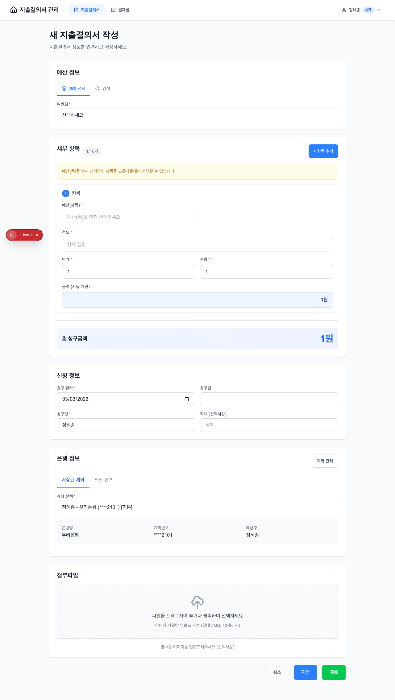
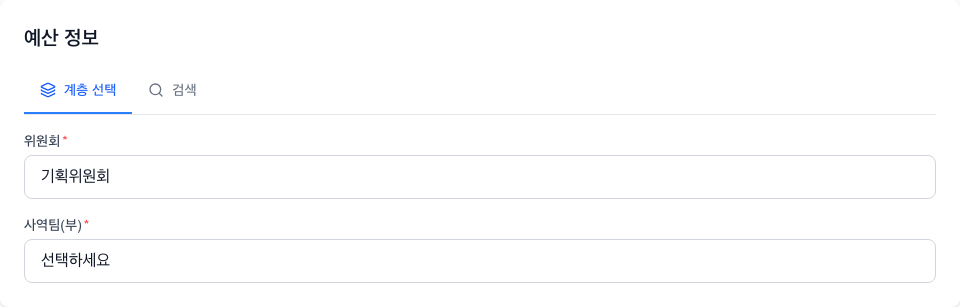
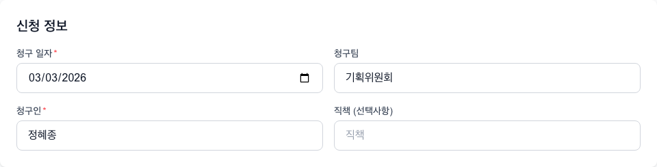
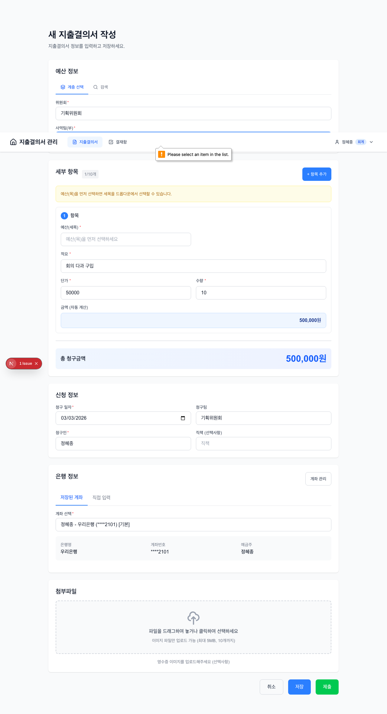

# 지출결의서 작성 가이드

지출결의서를 작성하고 제출하는 방법을 단계별로 안내합니다.

---

## 목차

1. [새 지출결의서 시작하기](#1-새-지출결의서-시작하기)
2. [예산 정보 입력](#2-예산-정보-입력)
3. [세부 항목 입력](#3-세부-항목-입력)
4. [신청 정보 입력](#4-신청-정보-입력)
5. [은행 정보 입력](#5-은행-정보-입력)
6. [첨부파일 업로드](#6-첨부파일-업로드)
7. [결재선 미리보기](#7-결재선-미리보기)
8. [저장과 제출](#8-저장과-제출)
9. [서명/도장 선택](#9-서명도장-선택)
10. [지출결의서 수정](#10-지출결의서-수정)
11. [자주 묻는 질문](#11-자주-묻는-질문)

---

## 1. 새 지출결의서 시작하기

### 접근 방법

**데스크톱**:
- 상단 메뉴 → "새 지출결의서" 클릭
- 또는 목록 페이지 → "+ 새 지출결의서" 버튼 클릭

**모바일**:
- 하단 네비게이션 → "+" 버튼 탭



---

## 2. 예산 정보 입력

예산 정보는 **4단계 계층 선택** 방식으로 입력합니다.



### 선택 순서

| 순서 | 항목 | 설명 | 예시 |
|------|------|------|------|
| 1 | 위원회 | 최상위 분류 | 재정위원회 |
| 2 | 사역팀/부 | 위원회 하위 조직 | 재정팀 |
| 3 | 예산(항) | 예산 대분류 | 사무행정비 |
| 4 | 예산(목) | 예산 중분류 | 회의접대비 |

### 선택 규칙

- 상위 항목을 선택해야 하위 항목이 활성화됩니다
- 상위 항목 변경 시 하위 항목은 초기화됩니다
- **예산(목)**까지 선택하면 세부 항목에서 **예산(세목)**을 선택할 수 있습니다

### 최근 사용 예산

자주 사용하는 예산 항목은 빠르게 선택할 수 있습니다.

---

## 3. 세부 항목 입력

하나의 지출결의서에 **1~10개**의 세부 항목을 입력할 수 있습니다.


### 각 항목의 입력 필드

| 필드 | 설명 | 필수 | 예시 |
|------|------|------|------|
| 예산(세목) | 드롭다운에서 선택 | O | 아웃팅비_재정팀 |
| 적요 | 지출 상세 설명 | O | 재정팀 회식비 |
| 단가 | 건당 금액 (원) | O | 50,000 |
| 수량 | 개수/인원 | O | 10 |
| 금액 | 자동 계산 | 자동 | 500,000 |

### 금액 자동 계산

```
금액 = 단가 × 수량
```

단가나 수량을 입력하면 금액이 자동으로 계산됩니다.

### 적요 입력 도우미

적요 필드에 포커스하면 해당 세목의 예제가 툴팁으로 표시됩니다. 예제를 클릭하면 자동 입력됩니다.

### 음성 입력 (모바일)

적요 필드 옆의 마이크 버튼을 탭하면 음성으로 입력할 수 있습니다.

> **지원 브라우저**: Chrome, Safari

### 항목 추가/삭제

- **추가**: "+ 항목 추가" 버튼 클릭 (최대 10개)
- **삭제**: 각 항목의 "X" 버튼 클릭 (최소 1개 유지)

---

## 4. 신청 정보 입력

청구인 정보를 입력합니다.



### 입력 항목

| 필드 | 설명 | 필수 | 자동 입력 |
|------|------|------|----------|
| 청구일자 | 지출결의서 청구 날짜 | O | 오늘 날짜 |
| 청구팀 | 위원회 + 사역팀 | O | 자동 생성 |
| 청구인 | 작성자 이름 | O | 로그인 사용자 |
| 직책 | 작성자 직책 | - | - |

### 청구팀 자동 생성

예산 정보에서 선택한 **위원회**와 **사역팀**이 조합되어 자동 생성됩니다.

예: "재정위원회 재정팀"

---

## 5. 은행 정보 입력

지급받을 은행 계좌 정보를 입력합니다.


### 두 가지 입력 모드

#### 모드 1: 저장된 계좌

미리 저장해둔 계좌를 드롭다운에서 선택합니다.
- 기본 계좌가 있으면 자동 선택됩니다
- 계좌번호는 보안을 위해 일부 마스킹됩니다

#### 모드 2: 직접 입력

새 계좌 정보를 직접 입력합니다.

| 필드 | 설명 | 필수 |
|------|------|------|
| 은행명 | 은행 이름 | O |
| 계좌번호 | 숫자만 입력 | O |
| 예금주 | 예금주 이름 | O |

### 계좌 관리

"계좌 관리" 버튼을 클릭하면 새 계좌를 추가하거나 기존 계좌를 삭제할 수 있습니다.

---

## 6. 첨부파일 업로드

영수증이나 증빙 서류를 첨부합니다. (선택사항)


### 업로드 방법

1. **드래그 앤 드롭**: 파일을 끌어다 놓기
2. **클릭하여 선택**: 업로드 영역 클릭 후 파일 선택
3. **카메라 촬영** (모바일): 카메라 아이콘 탭하여 바로 촬영

### 제한 사항

| 항목 | 제한 |
|------|------|
| 파일 형식 | 이미지 (jpg, png, gif, webp), PDF |
| 파일 크기 | 각 5MB 이하 |
| 파일 개수 | 최대 10개 |

### 파일 미리보기

업로드된 파일은 썸네일로 미리보기됩니다. 클릭하면 원본 크기로 볼 수 있습니다.

---

## 7. 결재선 미리보기

예산 정보를 모두 선택하면 결재선과 예산 현황이 표시됩니다.


### 결재 단계

```
1차 결재: 세목 담당자 (팀장)
     ↓
2차 결재: 회계
     ↓
3차 결재: 재정팀장
```

### 전결 처리

세목 담당자가 재정팀장인 경우, 1차 결재가 자동으로 승인됩니다 (전결).

### 예산 현황

| 항목 | 설명 |
|------|------|
| 배정 예산 | 해당 세목의 연간 배정 예산 |
| 사용 금액 | 현재까지 사용한 금액 |
| 잔여 예산 | 배정 예산 - 사용 금액 |
| 청구 후 잔액 | 잔여 예산 - 현재 청구 금액 |

### 예산 초과 경고

청구 금액이 잔여 예산을 초과하면 빨간색 경고 메시지가 표시됩니다.

---

## 8. 저장과 제출

작성이 완료되면 저장하거나 제출합니다.

### 버튼 설명

| 버튼 | 동작 | 결과 상태 |
|------|------|----------|
| 취소 | 작성 취소, 이전 페이지로 이동 | - |
| 저장 | 임시 저장 (나중에 계속 작성) | DRAFT (작성중) |
| 제출 | 결재 요청 (결재자에게 전달) | PENDING (결재대기) |

### 저장 (임시저장)

- 작성 중인 내용을 저장합니다
- "내 지출결의서" 목록에서 "작성중" 상태로 찾을 수 있습니다
- 제출하기 전까지 수정이 가능합니다

### 제출 (결재 요청)

- 결재선의 1차 결재자에게 결재 요청이 전달됩니다
- **제출 후에는 수정할 수 없습니다** (회수 후 수정 가능)
- 서명/도장 선택이 필요합니다

---

## 9. 서명/도장 선택

제출 시 청구인 서명 또는 도장을 선택합니다.



### 서명 방식

#### 방식 1: 저장된 서명/도장

마이페이지에서 미리 등록해둔 서명 또는 도장을 선택합니다.
- 기본 서명이 설정되어 있으면 자동으로 사용됩니다

#### 방식 2: 실시간 서명

화면에 직접 서명을 그립니다.
- 마우스 또는 터치로 서명합니다
- "다시 그리기" 버튼으로 초기화할 수 있습니다

### 서명 등록 안내

저장된 서명이 없는 경우 등록 안내가 표시됩니다.
"서명 등록하러 가기" 버튼으로 마이페이지로 이동합니다.

---

## 10. 지출결의서 수정

### 수정 가능 상태

| 상태 | 수정 가능 | 비고 |
|------|----------|------|
| DRAFT (작성중) | O | 자유롭게 수정 |
| REJECTED (반려됨) | O | 수정 후 재제출 가능 |
| WITHDRAWN (회수됨) | O | 수정 후 재제출 가능 |
| PENDING (결재대기) | X | 회수 후 수정 가능 |
| APPROVED (승인됨) | X | 수정 불가 |

### 수정 시 지출일자

수정 모드에서만 **지출일자** 필드가 표시됩니다.
신규 작성 시에는 지출일자를 입력하지 않습니다.

### 회수 후 수정

결재 대기 상태에서 수정이 필요한 경우:

1. 상세 페이지에서 "회수" 버튼 클릭
2. 상태가 "회수됨"으로 변경됨
3. "수정" 버튼으로 수정 페이지 진입
4. 수정 완료 후 다시 제출

---

## 11. 자주 묻는 질문

### Q1: 예산(세목)이 선택되지 않아요

**A**: 예산(목)을 먼저 선택해야 합니다. 예산 정보에서 항/목까지 선택하면 세부 항목에서 세목을 선택할 수 있습니다.

### Q2: 저장 후 어디서 찾나요?

**A**: "내 지출결의서" 메뉴에서 상태가 "작성중"인 항목을 찾을 수 있습니다.

### Q3: 제출 후 수정하고 싶어요

**A**: 결재 전이라면 "회수" 버튼으로 회수 후 수정할 수 있습니다. 회수 후 상태가 "회수됨"으로 변경됩니다.

### Q4: 첨부파일이 업로드되지 않아요

**A**: 다음을 확인해주세요:
- 파일 형식: 이미지 또는 PDF만 가능
- 파일 크기: 5MB 이하
- 파일 개수: 10개 이하

### Q5: 카메라가 작동하지 않아요

**A**: HTTPS 연결이 필요합니다. localhost에서는 정상 작동합니다.

### Q6: 음성 입력이 안 돼요

**A**: Chrome 또는 Safari 브라우저를 사용해주세요. Web Speech API를 지원하는 브라우저에서만 작동합니다.

### Q7: 결재선이 표시되지 않아요

**A**: 예산 정보(위원회, 사역팀, 항, 목)와 세부 항목의 세목을 모두 선택해야 결재선이 표시됩니다.

### Q8: 서명이 저장되어 있지 않아요

**A**: 마이페이지 > 서명/도장 관리에서 서명 또는 도장을 등록해주세요. 기본 서명으로 설정하면 제출 시 자동으로 사용됩니다.

### Q9: 오프라인에서 저장이 되나요?

**A**: 네, 오프라인에서도 임시저장이 가능합니다. 저장된 내용은 온라인 복귀 시 자동으로 동기화됩니다. 단, 제출은 온라인 상태에서만 가능합니다.

### Q10: 총 청구금액이 맞지 않아요

**A**: 총 청구금액은 모든 세부 항목의 금액 합계입니다. 각 항목의 단가와 수량을 확인해주세요.
