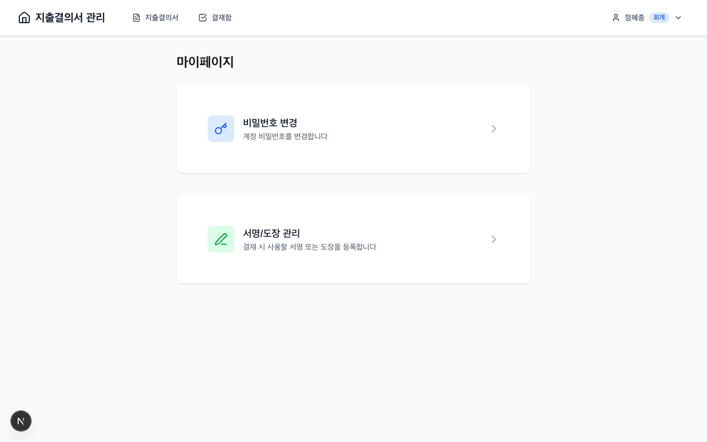

# 푸시 알림 가이드

웹 푸시 알림을 설정하고 사용하는 방법을 안내합니다.

---

## 목차

1. [웹 푸시 알림이란?](#1-웹-푸시-알림이란)
2. [알림 권한 설정](#2-알림-권한-설정)
3. [알림 종류](#3-알림-종류)
4. [알림 설정 변경](#4-알림-설정-변경)
5. [문제 해결](#5-문제-해결)

---

## 1. 웹 푸시 알림이란?

### 개요

웹 푸시 알림은 브라우저를 통해 실시간으로 알림을 받을 수 있는 기능입니다. 앱을 설치하지 않아도 중요한 결재 알림을 받을 수 있습니다.

### 장점

| 장점 | 설명 |
|------|------|
| 실시간 알림 | 결재 이벤트 발생 시 즉시 알림 |
| 백그라운드 알림 | 브라우저를 닫아도 알림 수신 |
| 다기기 지원 | PC, 모바일 모두 알림 가능 |
| 앱 설치 불필요 | 브라우저만 있으면 사용 가능 |

### 지원 브라우저

| 브라우저 | 지원 여부 | 비고 |
|----------|----------|------|
| Chrome | O | 권장 |
| Edge | O | |
| Firefox | O | |
| Safari | △ | macOS 13+, iOS 16.4+ |

> **참고**: Safari에서는 PWA 설치 후 알림을 받을 수 있습니다.

---

## 2. 알림 권한 설정

### 권한 요청 과정


**순서**:

1. 사이트 접속 시 알림 권한 요청 배너가 표시됩니다
2. **"알림 받기"** 버튼을 클릭합니다
3. 브라우저의 권한 요청 팝업이 나타납니다
4. **"허용"**을 선택합니다

### 권한 상태

| 상태 | 설명 |
|------|------|
| 허용 (granted) | 알림 수신 가능 |
| 거부 (denied) | 알림 차단됨 |
| 기본값 (default) | 아직 선택하지 않음 |

### 거부된 권한 다시 허용하기

알림 권한을 거부한 경우, 브라우저 설정에서 직접 변경해야 합니다.

#### Chrome

1. 주소창 왼쪽의 **자물쇠 아이콘** 클릭
2. **"사이트 설정"** 선택
3. **"알림"**을 **"허용"**으로 변경

또는:

1. 주소창에 `chrome://settings/content/notifications` 입력
2. 해당 사이트를 **"허용"** 목록에 추가

#### Safari

1. Safari > 환경설정 > 웹사이트 > 알림
2. 해당 사이트의 설정을 **"허용"**으로 변경

#### Edge

1. 주소창 왼쪽의 **자물쇠 아이콘** 클릭
2. **"사이트 권한"** 선택
3. **"알림"**을 **"허용"**으로 변경

#### Firefox

1. 주소창 왼쪽의 **자물쇠 아이콘** 클릭
2. **"연결 보안"** 선택
3. **"권한 더 보기"** 클릭
4. **"알림"** 권한을 **"허용"**으로 변경

---

## 3. 알림 종류

### 결재 관련 알림


| 이벤트 | 수신자 | 알림 내용 |
|--------|--------|----------|
| 결재 제출 | 결재자 | 새로운 결재 요청이 도착했습니다 |
| 결재 승인 | 신청자 | 결재가 승인되었습니다 |
| 결재 반려 | 신청자 | 결재가 반려되었습니다 + 사유 |
| 결재 회수 | 대기 중 결재자 | 결재 요청이 회수되었습니다 |
| 지급 완료 | 신청자 | 지급이 완료되었습니다 |

### 알림 예시

**결재 제출 알림**:
```
🔔 새 결재 요청
홍길동님이 지출결의서를 제출했습니다.
금액: 500,000원
[결재하기]
```

**결재 승인 알림**:
```
✅ 결재 승인
지출결의서가 승인되었습니다.
결재자: 김팀장
[상세보기]
```

**결재 반려 알림**:
```
❌ 결재 반려
지출결의서가 반려되었습니다.
사유: 첨부파일 누락
[수정하기]
```

### 알림 클릭 동작

알림을 클릭하면 해당 지출결의서의 상세 페이지로 이동합니다.

---

## 4. 알림 설정 변경

### 설정 페이지 접근



1. 우측 상단 프로필 아이콘 클릭
2. **"설정"** 메뉴 선택
3. **"알림 설정"** 탭 선택

### 채널별 설정

각 알림 채널의 활성화 여부를 설정할 수 있습니다.

| 설정 | 설명 | 기본값 |
|------|------|--------|
| SMS 알림 | 문자 메시지 수신 여부 | 켜짐 |
| 카카오 알림톡 | 카카오톡 알림 수신 여부 | 켜짐 |
| 웹 푸시 알림 | 브라우저 알림 수신 여부 | 켜짐 |

### 이벤트별 설정

각 이벤트에 대해 알림 수신 여부를 개별 설정할 수 있습니다.

| 이벤트 | 설명 | 기본값 |
|--------|------|--------|
| 결재 제출 | 새 결재 요청 도착 시 | 켜짐 |
| 결재 승인 | 내 결의서 승인 시 | 켜짐 |
| 결재 반려 | 내 결의서 반려 시 | 켜짐 |
| 지급 완료 | 지급 완료 시 | 켜짐 |

### 테스트 알림

알림이 정상 작동하는지 확인하려면:

1. 알림 설정 페이지로 이동
2. **"테스트 알림 보내기"** 버튼 클릭
3. 테스트 알림이 수신되는지 확인

---

## 5. 문제 해결

### 알림이 오지 않음

**확인 사항**:

#### 1. 브라우저 설정 확인

사이트에서 알림이 허용되어 있는지 확인합니다.

- Chrome: 주소창 왼쪽 자물쇠 아이콘 > 사이트 설정 > 알림
- Edge: 주소창 왼쪽 자물쇠 아이콘 > 사이트 권한 > 알림
- Firefox: 주소창 왼쪽 자물쇠 아이콘 > 권한 더 보기 > 알림

#### 2. 운영체제 설정 확인

**Windows**:
1. 설정 > 시스템 > 알림
2. 브라우저 앱의 알림이 허용되어 있는지 확인

**macOS**:
1. 시스템 환경설정 > 알림
2. 브라우저 앱의 알림이 허용되어 있는지 확인

**Android**:
1. 설정 > 앱 > 브라우저
2. 알림 설정 확인

**iOS**:
1. 설정 > 알림 > Safari
2. 알림 허용 확인

#### 3. 방해 금지 모드 확인

방해 금지 모드(DND)가 켜져 있으면 알림이 표시되지 않습니다.

- Windows: 집중 지원 해제
- macOS: 방해금지 모드 해제
- iOS/Android: 방해 금지 모드 해제

#### 4. Service Worker 확인

개발자 도구에서 Service Worker 상태를 확인합니다.

1. 개발자 도구 열기 (F12)
2. Application 탭 선택
3. Service Workers 메뉴 확인
4. Status가 "activated and is running"인지 확인

---

### 알림 권한이 차단됨

브라우저 설정에서 직접 변경해야 합니다.

**Chrome**:
1. 주소창에 `chrome://settings/content/notifications` 입력
2. "차단" 목록에서 해당 사이트 제거
3. "허용" 목록에 추가

**Safari**:
1. Safari > 환경설정 > 웹사이트 > 알림
2. 해당 사이트 설정 변경

---

### 알림은 오는데 소리가 안 남

**확인 사항**:

1. 기기의 볼륨 설정 확인
2. 무음 모드 해제
3. 브라우저의 알림 소리 설정 확인
4. 방해 금지 모드 해제

---

### 구독 해제 후 다시 구독하기

1. 알림 설정 페이지로 이동
2. **"알림 구독 해제"** 클릭
3. 페이지 새로고침
4. **"알림 받기"** 버튼 클릭하여 다시 구독

---

### 특정 기기에서만 알림이 안 옴

웹 푸시 알림은 기기별로 개별 구독됩니다.

**해결 방법**:

1. 해당 기기에서 사이트 접속
2. 알림 권한 허용
3. 알림 설정에서 구독 상태 확인

---

### 자주 묻는 질문

**Q: 여러 기기에서 알림을 받을 수 있나요?**

A: 네, 각 기기에서 알림 권한을 허용하면 모든 기기에서 알림을 받을 수 있습니다.

**Q: 알림을 너무 많이 받아서 불편해요**

A: 알림 설정에서 특정 이벤트의 알림을 끌 수 있습니다. 예를 들어, 결재 승인 알림만 끄고 반려 알림은 받을 수 있습니다.

**Q: 데이터를 사용하나요?**

A: 알림 자체는 매우 적은 데이터를 사용합니다. (수 KB)

**Q: 배터리 소모가 심한가요?**

A: 웹 푸시 알림은 배터리 소모가 매우 적습니다. Service Worker가 효율적으로 관리됩니다.

**Q: 개인정보가 유출될 수 있나요?**

A: 푸시 알림은 암호화되어 전송되며, 사용자 동의 없이 알림을 보낼 수 없습니다.

**Q: SMS와 푸시 알림을 동시에 받을 수 있나요?**

A: 네, 알림 설정에서 각 채널을 개별적으로 활성화할 수 있습니다.

**Q: 브라우저를 닫아도 알림이 오나요?**

A: PWA로 설치한 경우, 브라우저를 닫아도 백그라운드에서 알림을 받을 수 있습니다. 일반 웹 브라우저에서는 브라우저가 열려 있어야 합니다.
